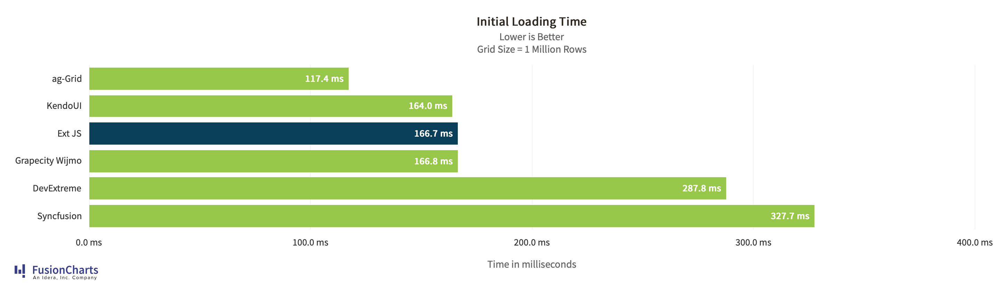
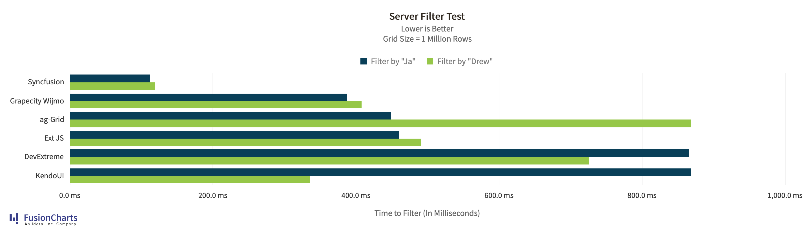
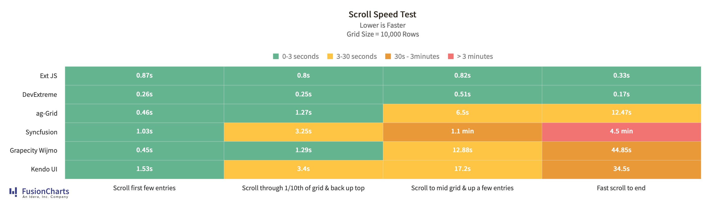
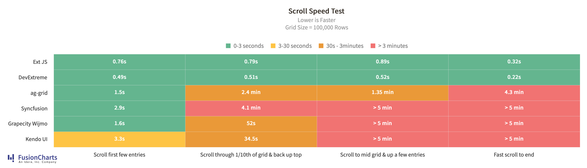
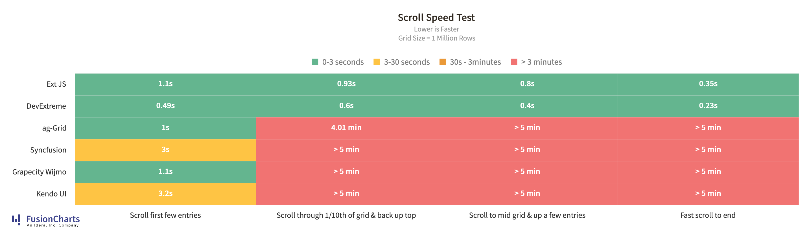

# Sencha's Ext JS Classic Grid Performance Benchmark Tests

Performance results, testing Sencha's Ext JS Classic Grid against competitor grids in a series of benchmark tests.

[Grids](#Grids)

[Results](#Results)

[Test Design](#Test-Design)

[Source](#Source)

# Grids
The following JavaScript Grid/Table libraries were evaluated. Click one of the links below to read the library specific README.

1. [ag-Grid](https://www.ag-grid.com/)
2. [DevExtreme Grid](https://js.devexpress.com/Overview/DataGrid/)
3. [ExtJS Classic](https://docs.sencha.com/extjs/7.2.0/classic/Ext.grid.Panel.html)
4. [GrapeCity FlexGrid (Wijimo)](https://www.grapecity.com/wijmo-flexgrid)
5. [Syncfusion](https://www.syncfusion.com/javascript-ui-controls/js-data-grid)
6. [KendoUI](https://demos.telerik.com/kendo-ui/grid/index?_ga=2.243489477.1357119994.1584889528-1295651737.1584889528)

# Results

## Results Rendered with Fusion Charts
### Initial Loading

### Server Side Filtering

### Scrolling

### Live Chart Links
* [Initial Loading](https://static.fusioncharts.com/sencha/initial-load-time.html)
* [Server-side Filtering](https://static.fusioncharts.com/sencha/server-filter-test.html)
* Scrolling
    * * [Small](https://static.fusioncharts.com/sencha/scroll-time-small.html)
    * * [Medium](https://static.fusioncharts.com/sencha/scroll-time-mid.html)
    * * [Large](https://static.fusioncharts.com/sencha/scroll-time-large.html)

// TODO: Markdown tables

## Raw Data

//TODO: link to CSV

# Test Design

A python script was developed to generate 1000 rows of JSON data on demand. Five data types are created, those being:

1. Text
2. Date
3. Boolean
4. Integer
5. Float

Where the option existed a vanilla JS approach is taken, additionally where a pre-minified version of the library existed that could be directly included
in the HTML page, this was used for simiplicity sake. However some libraries such as Grapecity Flexgrid and MaterialUI uses npm and are served on port 3000.

The JSON data was served from NGINX running locally on port 8082. The tests checked into the source control repository have been updated to
reference a local copy of the data so where possible the code can be run without needing to serve the file over an HTTP connection, this can be changed as desired if you wish to serve
the data from a different source/websserver.

Unless explicitly noted within the library and/or README file data was loaded prior to the test being run to reduce the impact of any latency from the webserver.

Results from each test are output in the console.log and also on the page.

The test wrapper code is located is the `src` directory and available as a static class (test_metrics_static.js) or one that can be instantiated (test_metrics.js).

This code is based upon Mats Brynste's approach to JS metrics.

## Test methodology

All tests were run on a Macbook pro with 2.6 GHz Intel Core i7 processor and 16 GB of RAM. A fresh install of Fire Fox with no plugins was used for the browser and NGINX installed via Mac brew.

## Test Types

The following tests were performed for each grid:

### Initalization/Import Time

Within each grid's folder the `init_time` test can be found.

This test measures the speed at which the grid is rendered after data is loaded.

### Filter Speed

Each grid also contains a `filter_speed` folder. This measures the application of
five filters to the 5 columns specified by the JSON data.

### Buffer/Load/Re-load Speed

This test measures the speed of loading/importing the data into the grid, with a pre-defined buffer value.
Where a buffer options does not exist, or is not accessible via the API, then a page size value is set. Typically the page size is associated with pagantion features.

In each instance 10 grids are drawn, so the time taken to render and re-render the data with a modified
page size or buffer size can be measured.

For each grid this test can be found in the `buffer_speed` folder.

### Scrolling/Load Speed

Each grid contains a `scrolling_speed` directory. This measures the FPS and time it takes to scroll each grid from top to bottom with data being loaded into the grid using the default
mechanisms with no modifications to buffer size or similar.

# Source

## Client
The `client` directory includes Sencha's implementation of the Ext JS Classic grid and each of the competitor grids used in the performance test. 

## Server
The `client` directory contains the raw data api used in performance testing backend to retrieve data. 

